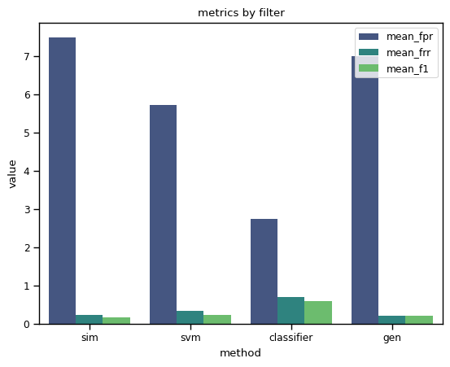

## ctmatch


**program for matching clinical trials to patient text descriptions**

This package is designed generally for the task described in the precision medicine track of TREC since 2021.
That is, an information retrieval task to match patient descriptions (topics) to clinical trials data (xml documents)

ctmatch leverages several tools to build the representations in the dataset against which the topics are matched,
as well as langugage models that have been fine-tuned on the curated ctmatch dataset of relevance-labelled topic, document 
pairs. 

The pipeline currently matches user input topics to the static snapshot of clinical trials data downloaded for the TREC task from december of 2015, now stored on huggingface in the datasets `semaj83/ctmatch_classification` and `semaj83/ctmatch_ir` but can be updated with a current dataset of clinical trials data using ctproc to process.


### pipeline filters

Currently 4 filters are applied to the set of documents for ranking and reranking:

1. The first (sim) filter is based on extracted document eligbility criteria embedding and topic cosine similarity (see ctmatch_ir dataset):
   
   - embeddings (384-dim) are created using the last hidden layer of SentenceTransformers(`sentence-transformers/all-MiniLM-L6-v2`)
   
   - inferred category vectors are arbitrarily selected 14 classes i.e. pulmonary, cardiac, health, other.... with 
   probabilites as softmax of the output from a zero-shot classification of `facebook/bart-large-mnli` applied to the 
   'condition' field of the ct documents and the raw text of the topic.

   The docs are ranked by this combined distance score and the top {1000} closest documents to the topic are selected (out of ~384k documents), passed to the next filter.


2. The second (SVM) filter uses the same embedded representations as the sim fiter:
   - an SVM is used to learn a decision boundary between the topic as one class and the documents as another, then passes forward the top closest {100} documents to the decision boundary.


3. The third (classification) filter again uses a different LM, , fine-tuned for sequece classification on the `semaj83/ctmatch_classification` dataset of abelled topic, document, relevancy triples.


4. The fourth (gen) filter uses a prompting-based approach to query a gpt model with topic, id'd doc texts and asks the LM to generate a list 


### api

```
topic = "A 46 yo male with gastric cancer. He has recieved 3 rounds of chemotherapy without radiation and recent MRI shows tumor shrinking to < 4 cm. in diameter."

ctm = CTMatch()
ranked_pairs = ctm.match_pipeline(topic, top_k=10)

"""
[('NCT00003788', 'Inclusion Criteria: Histologically confirmed newly diagnosed or recurrent supratentorial glioblastoma or malignant astrocytoma Grade 3 or 4 astrocytoma as defined by the Daumas-Duport classification Suitable for radical resection on the basis of imaging studies Patients with recurrent disease must have failed surgery and radiotherapy Age and over Performance status Karnofsky 60-100% for newly diagnosed tumor Karnofsky 70-100% for recurrent tumor Life expectancy At least 3 months Hematopoietic Recurrent tumor WBC at least 2,000/mm^3 Platelet count at least 80,000/mm^3 Hepatic Recurrent tumor PT/PTT no greater than 1.5 times upper limit of normal (ULN) Bilirubin and LFTs less than 2 times ULN Alkaline phosphatase no greater than 3 times ULN GGT no greater than 3 times ULN Renal Creatinine no greater than 2 mg/dL Other Not pregnant or nursing PRIOR Biologic therapy Not specified Chemotherapy Not specified Endocrine therapy Not specified Radiotherapy See Disease Characteristics No prior cranial radiotherapy for newly diagnosed tumor Surgery See Disease Characteristics, Exclusion Criteria:')]
"""

```

### evaluation:

Evaluation is done with MRR (mean reciprocal rank) on the resulting documents from the labelled dataset and the `Evaluator` object in the evaluator.py module. (see evaluation notebook)




### classifier training

This repo also contains code in the CTMatch object to train a classifier on the `semaj83/ctmatch_classification` dataset (see finetuning notebook).
Several LMs are supported but others may need to code modifications, starting with adding to the list of supported LMs at the top of dataprep.py

